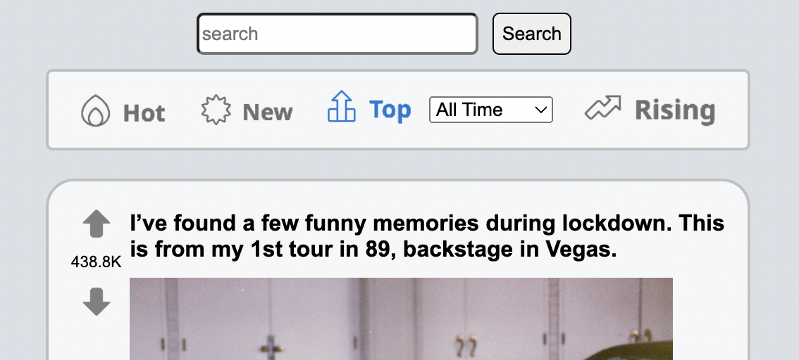
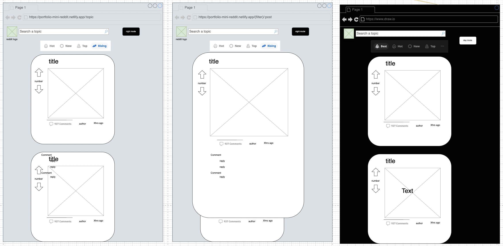
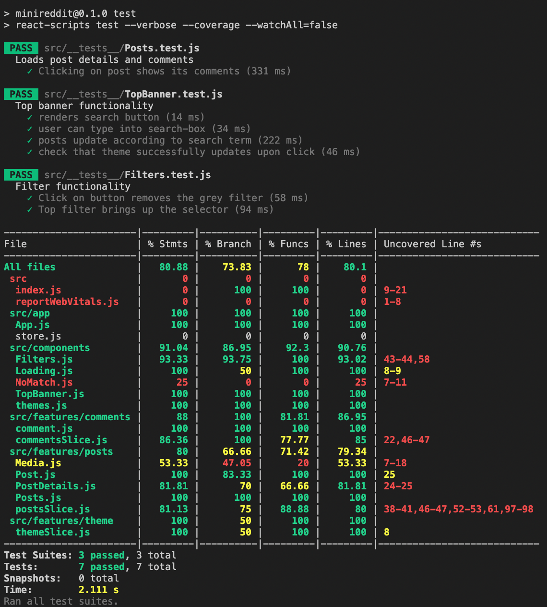
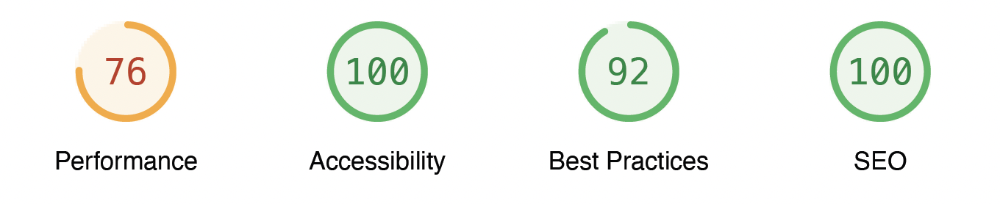

# Mini-Reddit

This app was create as the front-end section's final project of [Codecademy](https://www.codecademy.com/learn)'s *Full-Stack Engineering* course.

This app is a mini Reddit viewer. It doesn't allow the user to comment or vote. The user can filter posts usring predefined categories, or by searching for a term in the search bar. By clicking on a post, the viewer can see its comments.

# Project Requirements:

- [x] Build the application using React and Redux
- [x] Version control your application with Git and host the repository on GitHub
- [x] Use a project management tool (GitHub Projects, Trello, etc.) to plan your work
- [ ] Write a README (using Markdown) that documents your project including:
  - [x] Wireframes
  - [x] Technologies used
  - [x] Features
  - [ ] Future work
- [x] Write unit tests for your components using Jest and Enzyme
- [x] Write end-to-end tests for your application
- [x] Users can use the application on any device (desktop to mobile)
- [x] Users can use the application on any modern browser
- [x] Users can access your application at a URL
- [x] Users see an initial view of the data when first visiting the app
- [x] Users can search the data using terms
- [x] Users can filter the data based on categories that are predefined
- [x] Users are shown a detailed view (modal or new page/route) when they select an item
- [x] Users are delighted with a cohesive design system
- [ ] Users are delighted with animations and transitions
- [ ] Users are able to leave an error state
- [ ] Get 90+ scores on Lighthouse
    We understand you cannot control how media assets like videos and images are sent to the client. It is okay to have a score below 90 for Performance if they are related to the media from Reddit.
- [ ] OPTIONAL: Get a custom domain name and use it for your application
- [x] OPTIONAL: Set up a CI/CD workflow to automatically deploy your application when the master branch in the repository changes
- [ ] OPTIONAL: Make your application a progressive web app

# Prerequisites:

- [x] HTML
- [x] CSS
- [x] JavaScript
- [x] React
- [x] Redux
- [x] Jest, Enzyme, and Selenium
- [x] Git and GitHub
- [x] Command line and file navigation
- [x] Wireframing

# WireFraming

Wireframes were created using [diagrams.net](https://www.diagrams.net/).

# Code Coverage

# Lighthouse Page Quality Score

[Lighthouse](https://web.dev/measure/) gave a 72% score for the page's performance. The 90% score objective was not achieved.

To score higher on the performance metric, the app could display fewer posts. At the moment, [Reddit](https://www.reddit.com/)'s api returns data for 25 posts. Instead of displaying all of them, the app could display only half.

Read the full report [here](./ProjectManagement/Lighthouse%20Report%20Viewer.pdf)

# Project Management Tool

A basic kanban using Github Projects was used to managed the tasks. The project was broken down into the following steps:
- Create a WBS and schedule tasks
- Create wireframes
  - Choose colors
  - Determine components
- Map Reddit's API JSON response
- Create a react folder
  - Add necessary libraries
- Setup git/GitHub for verison tracking
- Setup Netlify for continuous deployment
- Write app logic
- Write CSS and make app responsive
- Write tests
  - Mock API calls
  - Watch code coverage
- Write comments to the code
